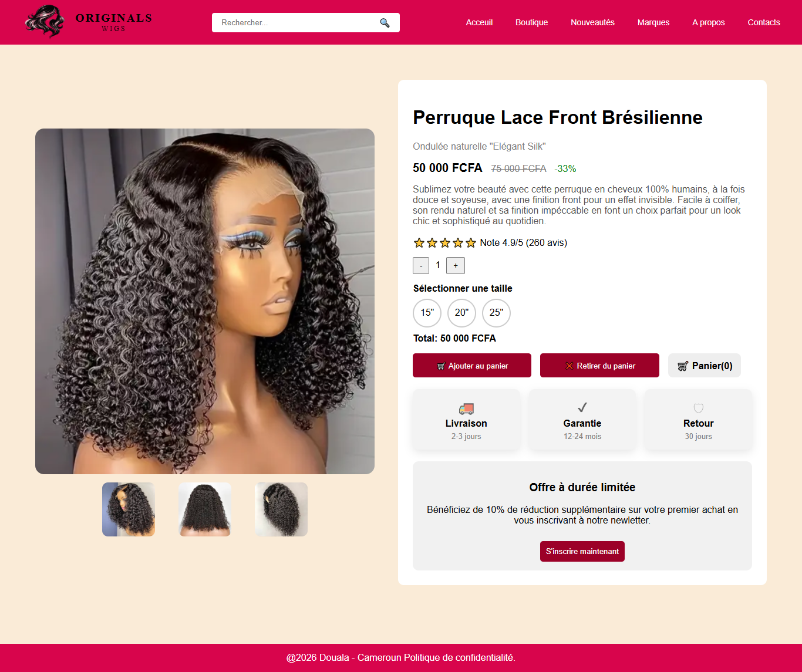

# TIPDA1_NgoungaFarida_Projet4
Ce projet est une page de produit e-commerce présentant une perruque. Il a été réalisé en HTML, CSS et JavaScript.
# Fonctionnalités
-Galerie d'images de la perruque (plusieurs vues)
-Affichage du nom du produit et du prix
-Sélecteur de quantité
-Sélecteur de taille
-Calcul dynamique du prix total en fonction de la quantié
-Bouton "Ajouter au panier" et "Retirer du panier"
-Interface utilisateur simple, propre et responsive
# Technologies utilisées
-HTML
-CSS
-JavaScript (Interaction et calcul dynamique)
# Structure du projet
-Index.html (Structure de la page produit)
-style.css (Design et mise en forme)
-script.js (gestion des interactions (quantité, prix))
# Utilisation
-Ouvrir le fichier "Index.html" dans un navigateur
-Interagir avec la page (changer la quantité, voir le prix évoluer)
# Aperçu

